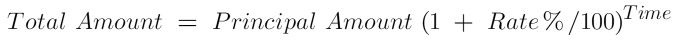

XYZ Bank has launched its Fixed Deposit Scheme. As per this, for amounts more than Rs 25000, it offers following rates of interest for its Fixed Deposit accounts:

| Time (in years) | Rate of Interest (% per annum) |
|:---------------:|:------------------------------:|
|        7        |               7.0              |
|        10       |               8.5              |
|        15       |               9.5              |
|        20       |              12.5              |

For principal amounts less than Rs 25000, it offers rate of interest as 6.0% per annum. For time other than the specified ones, the rate of interest is 6.75%.

As per bank's FD scheme, create an application that obtains principal amount and time from the user and then determines how much final amount the user will be receiving at the end of the time.

Total amount is calculated with compound interest amount as per following formula:

